<picture>
  <source media="(prefers-color-scheme: dark)" srcset="dark.svg">
  <source media="(prefers-color-scheme: light)" srcset="light.svg">
  
</picture>

<!-- socials -->
## <b> CONNECT WITH ME:</b>

  

  

  

<!-- technology -->
## <b> TECHNOLOGY STACK:</b>

### Languages:

### CSS Frameworks:

### JavaScript Frameworks:

### Database:

### Deployment:

### Design:

### Tools:

## 📈 Yearly Contribution Heatmap

 

## 🐍 Contribution Snake
<picture>
  <source media="(prefers-color-scheme: dark)" srcset="https://raw.githubusercontent.com/fahim1105/fahim1105/output/github-contribution-grid-snake-dark.svg">
  <source media="(prefers-color-scheme: light)" srcset="https://raw.githubusercontent.com/fahim1105/fahim1105/output/github-contribution-grid-snake.svg">
  
</picture>

 

<!-- pinned repos -->
## 📌 Pinned Projects

| Money-Map-Client | boi-poka-project | assignment-two |
|------------------|------------------|----------------|
|  |  |  |

 

<!-- github stats -->
## 📊 GitHub Stats

| GitHub Stats | Streak Stats | Top Languages |
|--------------|--------------|----------------|
|  |  |  |

---

<!-- Activity Graph -->
## 📊 Contribution Activity Graph

 

<!-- Trophies -->
## 🏆 GitHub Trophies

 

